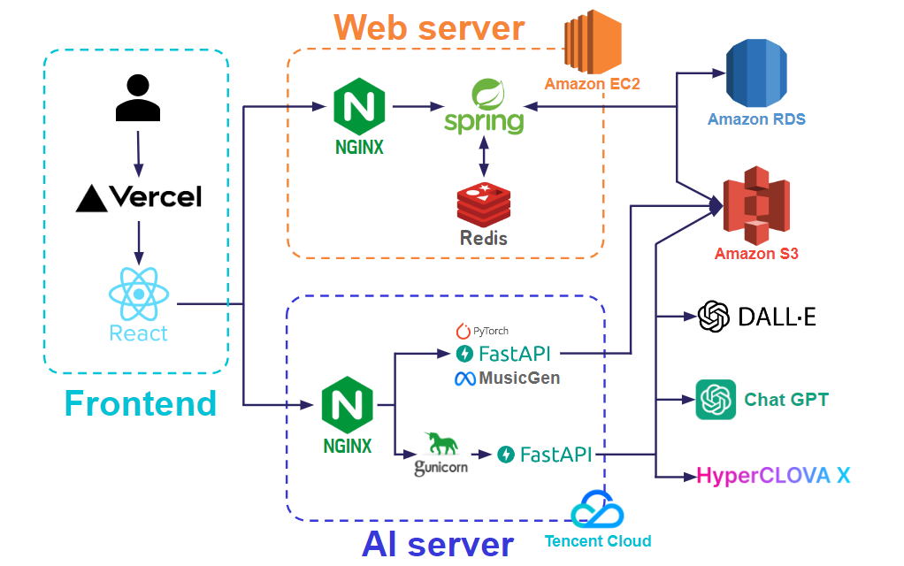

# 토리-Backend
세상에 없던 나만의 동화책, 토리의 백엔드 개발 레포지토리입니다.</br>
> 이화여자대학교 2023 캡스톤디자인과창업프로젝트</br> 
> 개발기간: 2023.06.09 - 2023.12

</br>

### 배포 주소
> 개발 버전: https://tori-fairytale.vercel.app/ </br>
> 백엔드: www.bemystory.store

</br>

## 시스템

> web server와 Amazon RDS, Amazon S3를 맡아 개발 진행

</br>

### 데이터베이스
AWS RDS의 MariaDB

</br>

### Open sources
- Spring Framework
- Redis
- MariaDB
- nginx

</br>

## 시작 가이드
### Requirements
For building and running the application you need:
- AWS EC2 배포
  - [java 17](https://www.oracle.com/java/technologies/downloads/#java17) 설치
  - [Redis 3.0.504](https://github.com/microsoftarchive/redis/releases) 설치
    ```
    $ cd /
    $ mkdir deploy
    $ vi application.yml
    ```
  - `application.yml` 파일에 database, jpa, redis, s3, jwt 설정
  - nginx 설치
    - [certbot으로 ssl 적용](https://z1-colab.tistory.com/entry/Nginx-Amazon-Linux-Certbot%EC%9D%84-%EC%9D%B4%EC%9A%A9%ED%95%9C-https-%EC%9D%B8%EC%A6%9D%EB%B0%9B%EA%B8%B0)
  - deploy.sh 스크립트를 통해 clone repository 및 빌드
    ```
    echo "> remove repository"
    sudo rm -rf be-my-story-backend

    echo "> git clone"
    git clone https://github.com/6garlics/be-my-story-backend

    echo "> application.yml 이동"
    cd /deploy
    sudo rm -rf nohup.out
    sudo mkdir /deploy/be-my-story-backend/src/main/resources
    sudo cp application.yml ./be-my-story-backend/src/main/resources

    echo "> build"
    cd /deploy/be-my-story-backend/
    sudo chmod +x gradlew
    ./gradlew clean build

    echo "> redis 재실행"
    REDIS_PID=$(ps -ef | grep redis-server | awk '{print $2}')
    echo "$REDIS_PID"
    if [ -z ${REDIS_PID} ]; then
    echo "> 현재 구동중인 redis가 없습니다."
    else
    echo "> sudo kill -9 $REDIS_PID"
    sudo kill -9 $REDIS_PID
    fi
    echo "> redis background 실행"
    redis-server --daemonize yes

    echo "> 현재 구동중인 애플리케이션 확인"
    CURRENT_PID=$(ps -ef | grep java | grep bemystory | awk '{print $2}')
    echo "$CURRENT_PID"
    if [ -z ${CURRENT_PID} ]; then
    echo "> 현재 구동중인 애플리케이션이 없으므로 종료하지 않습니다."
    else
    echo "> sudo kill -9 $CURRENT_PID"
    sudo kill -9 $CURRENT_PID
    #       sleep 10
    fi

    echo "> 배포"
    cd build/libs
    nohup java -jar *-SNAPSHOT.jar > /deploy/nohup.out 2>&1 &
    ```

## About Code
`/controller` : Presentation Layer </br>
`/service` : Application Layer </br>
`/repository` :  Data Access Layer </br>
`/config` : 환경 설정 </br>
`/domain` : Entities of Database </br>
`/dto` : Data Transfer Object </br>
`/exception` : 예외처리 </br>
`/utils` : JWT utilization </br>
